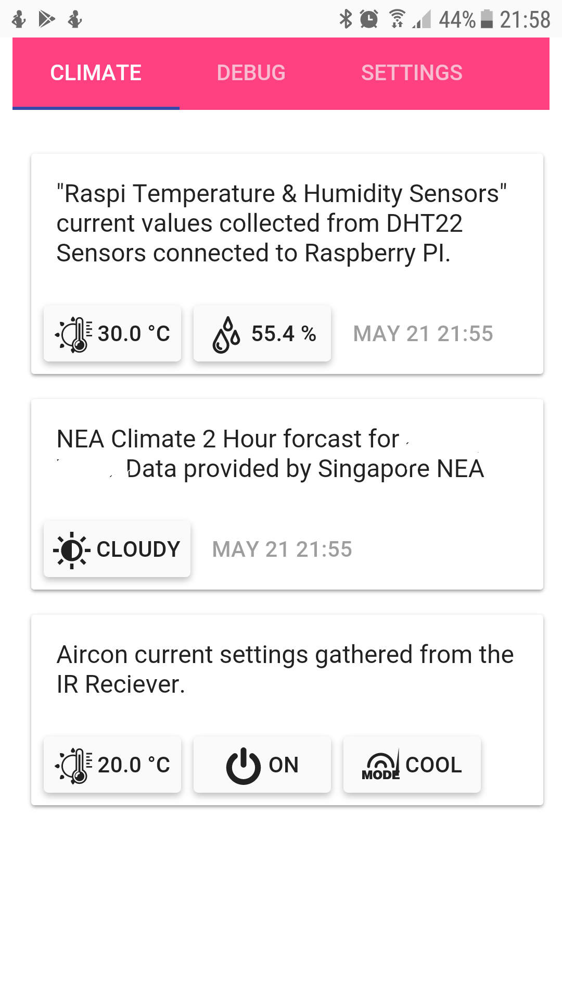

# RaspiMicroClimate

Raspberry PI & Arudino Project for MicroClimate Control.
'RaspiMicroClimate' is the IOT Data Collecter and in future the Controller.

## Components & Feature 1.0 
* Raspberry Pi : Connect to NEA Webservices for Current weather outside.
* Raspberry Pi : Collect Temperature and Humidity using DHT22 , GPIO
* Arudino : Listen to current Aircon Settings using IR Reader GPIO, Monitor Mode, Temperature and on/off
* Raspberry : Web Service for collating all data from sensors to a sqlite3 database , uses flask for webserver.
* Raspberry : Web Application built in AngularJS for UI 
 

## Components & Feature 2.0 [comming]
* Analytics on data set
* Implement ML to train Aircon to optimal temp/humidity with auto switch over/on.
* Add IR Transmitter to control via Arudino.

## Resources & References

Aircon Notes :
Ideal Humidity 40 - 50 % , Lower the Himidity the cooler it is and more efficient for AC Cooling.
Mode  DRY, Humidity Control (drops icon) reduce humidity witout too much cooling , by pulling air to dehumidify.

External Sources and Licence Information.
http://www.flaticon.com/categories/weather/22

Installing flask instead of klien
http://blog.miguelgrinberg.com/post/the-flask-mega-tutorial-part-i-hello-world

sudo pip3 install virtualenv
sudo pip3 install flask
sudo pip3 install flask-login
sudo pip3 install flask-openid
sudo pip3 install flask-mail
sudo pip3 install flask-sqlalchemy
sudo pip3 install sqlalchemy-migrate
sudo pip3 install flask-whooshalchemy
sudo pip3 install flask-wtf
sudo pip3 install flask-babel
sudo pip3 install guess_language
sudo pip3 install flipflop
sudo pip3 install coverage

## Installation of Adafruit_Python_DHT for Raspberry PI
https://github.com/adafruit/Adafruit_Python_DHT

https://pillow.readthedocs.io/en/latest/installation.html

# Upgrading pip3 installed packages
pip3 freeze > requirements.txt
pip3 install --upgrade -r requirements.txt
rm requirements.txt
